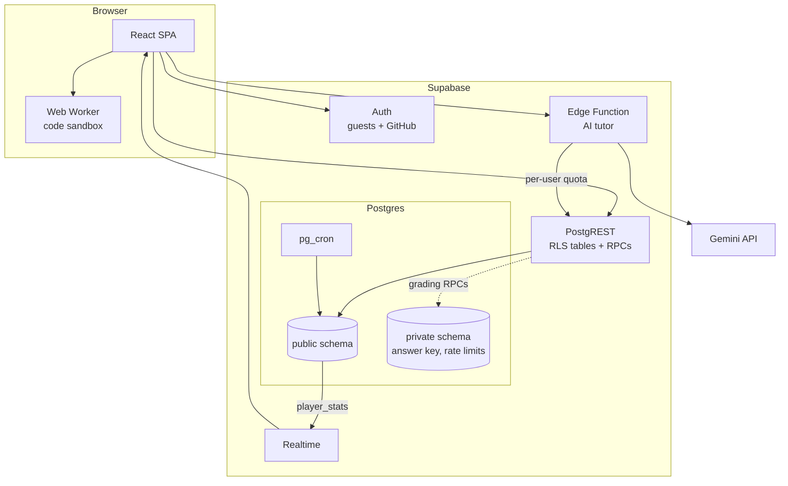

<div align="center">

# SkillVerse

**Every learning path is a constellation. The whole curriculum is a galaxy.** Every skill is a star with a lesson and free resources. Pick where you want to go, and SkillVerse lights up your personal path of stars to get there. Light every star on a path and it forms its constellation on your map.

**[Open the live demo](https://skillverse-sable.vercel.app)**, no account needed · [How it's built](https://skillverse-sable.vercel.app/about)

[](https://github.com/aryansajiv19/SkillVerse/actions/workflows/ci.yml)


</div>

https://github.com/user-attachments/assets/6c67ab06-b4ea-4e2b-ac92-dac078a04c20

## Why I built it

Most "learn to code" roadmaps are a long, flat checklist. You can't see how skills connect, you don't know what to learn next for the goal you actually have, and nothing tells you whether you've really understood something before moving on.

SkillVerse turns the roadmap into a sky you can navigate, a bit like The Odin Project with a sense of direction. Skills are stars, the lines between them are prerequisites, and every career path (full-stack, frontend, backend, AI, data, DevOps) is a constellation drawn through them. Click any star and it shows your personal path to it: the stars you still need, in order, each with a short lesson, hand-picked free resources, practice, and a knowledge check. Pass the check and the star lights up. Finish a path and its constellation forms. It started as a hackathon project and grew into a full-stack app with real accounts, server-side grading, a live leaderboard, and a codebase I'd be happy for someone to read.

## How it works

1. **Pick a destination.** 28 stars in four regions of the galaxy: Frontend, Backend, Data & AI, and DevOps & Cloud. Prerequisites cross regions, so LLM Apps needs both ML Basics and REST APIs.
2. **See your learning path.** Click any star, even one far away, and the map lights up the route to it: numbered stars in the order to learn them, skipping everything you've already mastered.
3. **Learn from the lesson.** Each star is a lesson: what you'll learn, an assignment of hand-picked free resources (MDN, web.dev, react.dev, the official docs and so on), and a cheat sheet for many skills.
4. **Practise.** 21 code challenges run real tests in your browser, plus a debugging game, for bonus XP.
5. **Pass the knowledge check.** A short quiz graded by the database. Miss one question and you still pass. The star lights up, and the next stars on your path unlock.
6. **Form constellations.** Seven learning paths are constellations named after real ones: Sagittarius, the Archer (full-stack developer), Lyra, Orion, Cygnus, Pyxis, Draco and Argo. Each one is a set of goal stars plus everything they need, so a path can span regions. Light its last star and it goes supernova: a shockwave, the figure flares in gold, and its name is written on your map, dashboard and public profile.
7. **Keep going.** XP, levels, streaks, achievements, a public profile with an activity heatmap, and a leaderboard that updates live.

The sky behaves like one, too. Stars several steps away from you are small and faint, like distant stars, and brighten as you get closer. Keep a streak going and a gold comet crosses the sky, its tail growing with every day. All of it is off with reduced motion.

No sign-up wall: every visitor gets a guest account on first load, and can connect GitHub to keep it.

<p align="center"></p>

<table>
  <tr>
    <td></td>
    <td></td>
  </tr>
  <tr>
    <td align="center">Click any star to see your learning path to it</td>
    <td align="center">Every star is a lesson with hand-picked free resources</td>
  </tr>
  <tr>
    <td></td>
    <td></td>
  </tr>
  <tr>
    <td align="center">Finished paths form their constellations, in gold</td>
    <td align="center">The last star on a path goes supernova</td>
  </tr>
  <tr>
    <td></td>
    <td></td>
  </tr>
  <tr>
    <td align="center">The galaxy: hollow rings are open, filled stars are mastered</td>
    <td align="center">Skill checks, graded on the server</td>
  </tr>
  <tr>
    <td></td>
    <td></td>
  </tr>
  <tr>
    <td align="center">Code challenges run in a sandboxed Web Worker</td>
    <td align="center">Public profiles</td>
  </tr>
  <tr>
    <td></td>
    <td></td>
  </tr>
  <tr>
    <td align="center">Live leaderboard</td>
    <td align="center">Dashboard and activity heatmap</td>
  </tr>
</table>

<p align="center"></p>


## Under the hood



The app has no custom server. Postgres enforces every rule through row-level security and a handful of functions, and one edge function relays the AI tutor. There's a deeper walkthrough in the app's **How it's built** page.

<p align="center"></p>

A few decisions I'm proud of:

* **The answers never reach the browser.** Quiz answers are written in [`content/challenges.ts`](content/challenges.ts), which nothing in the app imports. A build step splits them into a public catalog (questions, deterministically shuffled options) and a private answer key in Postgres that the API can't read. CI builds the app and fails if any explanation text appears in the shipped JavaScript.
* **The database is the only authority.** Clients can't write masteries or stats at all, and for code challenges they can insert one column: the user id and timestamp come from the server, so activity can't be forged or backdated to fake a streak. A pgTAP suite asserts these as schema-wide invariants, so a new table or function that skips them fails CI.
* **A leaderboard query that doesn't fall over.** The first version ranked each player by counting everyone with more XP. That's fine for a top-50 read, but the view is public, and filtering on rank ran that count for every player. [Measured](scripts/bench/README.md) at 10,000 players: **5,398 ms → 3.4 ms** with a single `rank()` window pass. At 50,000 players the old query hit a 120 s timeout; the new one takes 17.6 ms.
* **Stats are maintained, not recomputed.** Statement-level triggers with transition tables refresh a player's stats once per write, however many rows it touched. Resetting a fully completed account takes 0.57 ms, versus 4.4 ms refreshing once per row. A test proves the incremental numbers always match a full recompute.
* **Learner code runs in a disposable worker.** JavaScript challenges run in a Web Worker with no DOM or storage access, killed after 2 seconds. HTML and CSS are checked with the browser's own parsers, honouring the real cascade and selector lists.
* **Constellations are derived, not stored.** A constellation is a few goal stars; its stars and lines are their prerequisite closure, computed from the catalog. Whether one has formed is a pure function of what you've mastered, so it can't drift out of sync, needs no new tables or policies, and resetting a skill un-forms it for free. The same function drives the map, the supernova, the dashboard and public profiles.
* **Three.js stays off the pages that don't need it.** Routes are code-split, so the 227 kB (gzipped) galaxy renderer only loads on the map. A shared profile link loads a 156 kB entry bundle.

## Things I learned the hard way

* **Put the right answer first and people will notice.** I wrote every multiple-choice question with the correct option first. A 164-agent review caught that "always pick A" passed four of the Backend checks. Options are now shuffled deterministically at build time, and a test fails if any position holds more than 40% of the answers.
* **Waiting for everything is a bug.** Under load, a finished quiz could sit on "Grading…" because the submit waited for every query in the app to refetch, including the leaderboard. It now waits only for the learner's own data, which also made the parallel e2e suite stable.
* **A free model tier can disappear under you.** The tutor's model was retired for new keys partway through. It's now one setting (`GEMINI_MODEL`), and the tutor degrades to a clear "not configured" state instead of breaking the page.

## Tests

| What | How | Run it |
|---|---|---|
| Database | 63 pgTAP tests: RLS, grading, stats vs full recompute, streaks, rate limits, guest cleanup, privilege invariants | `npx supabase test db` |
| Logic and content | 220 Vitest tests: catalog integrity, learning-path ordering, when constellations form, a reference solution proving every code challenge is solvable, the runner, theme contrast | `npm test` |
| The whole app | 19 Playwright tests, including axe WCAG 2.1 AA scans of 10 pages with no rules disabled | `npm run test:e2e` |
| Performance | Leaderboard and stats-trigger benchmarks at 10k and 50k players | [`scripts/bench/`](scripts/bench) |

Every push runs typecheck, lint, unit tests, a catalog freshness check, the build, the answer-leak check, the database tests and the e2e suite in [CI](.github/workflows/ci.yml).

## Run it yourself

Needs Node 22+ and Docker.

```bash
npm ci
npx supabase start          # local Postgres, Auth, Realtime and the edge runtime
cp .env.example .env.local  # paste API_URL and PUBLISHABLE_KEY from `npx supabase status`
npm run dev                 # http://localhost:8080
```

`npx supabase db reset` rebuilds the database from the migrations and the catalog. To fill the leaderboard with demo learners, load [`scripts/seed-demo.sql`](scripts/seed-demo.sql). After editing content, run `npm run db:catalog`.

## Where things live

| Folder | What's in it |
|---|---|
| [`src/pages/`](src/pages) | Galaxy, learn, dashboard, leaderboard, profiles, how it's built, account |
| [`src/components/map/`](src/components/map) | Pan and zoom, framing, the map's geometry |
| [`src/hooks/useProgress.ts`](src/hooks/useProgress.ts) | All data access: queries, RPCs, Realtime |
| [`src/lib/`](src/lib) | Auth, progress rules (learning paths, constellations), the code runner and its worker |
| [`src/content/`](src/content) | The skill graph, constellations, lessons and free resources |
| [`content/`](content) | Challenges as written, with answers (never imported by the app) |
| [`supabase/`](supabase) | Migrations, the generated catalog, pgTAP tests, the tutor function |
| [`e2e/`](e2e), [`scripts/`](scripts) | Browser tests, the catalog generator, benchmarks, media capture |

Security model and trade-offs: [`SECURITY.md`](SECURITY.md).

**Built with** React 18, TypeScript, Vite, Tailwind CSS, Radix, TanStack Query, Three.js, Supabase (Postgres, Auth, Realtime, Edge Functions, pg_cron), Gemini, Playwright and Vercel.

<div align="center">

Built by **Aryan Sajiv** · Original hackathon version with **Divyansh Jhajhria** · [GitHub](https://github.com/aryansajiv19)

</div>
