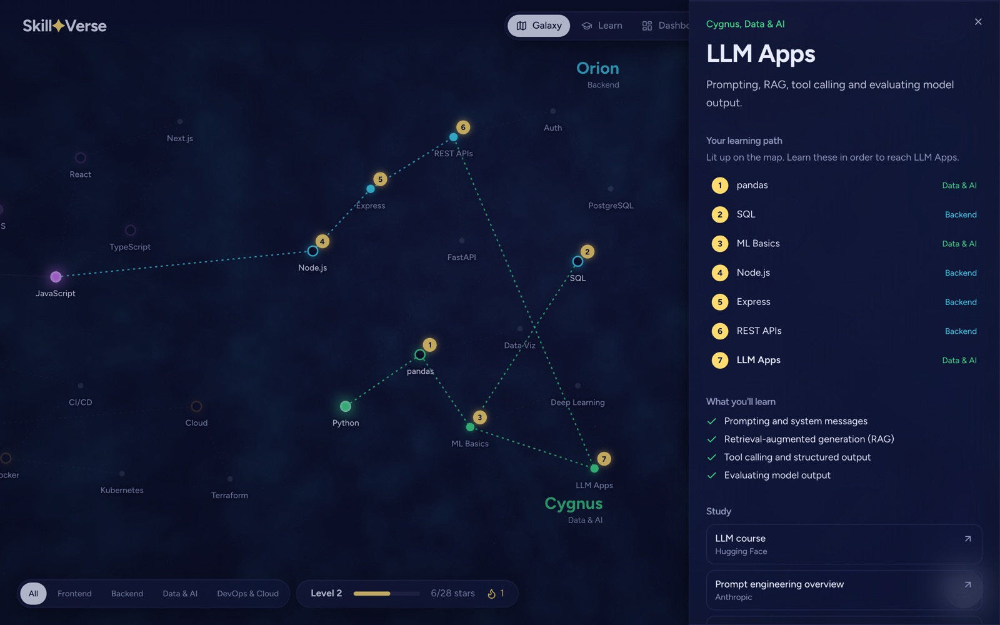
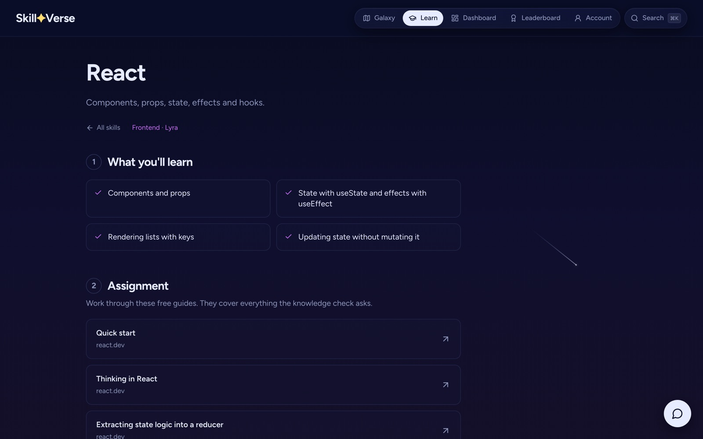
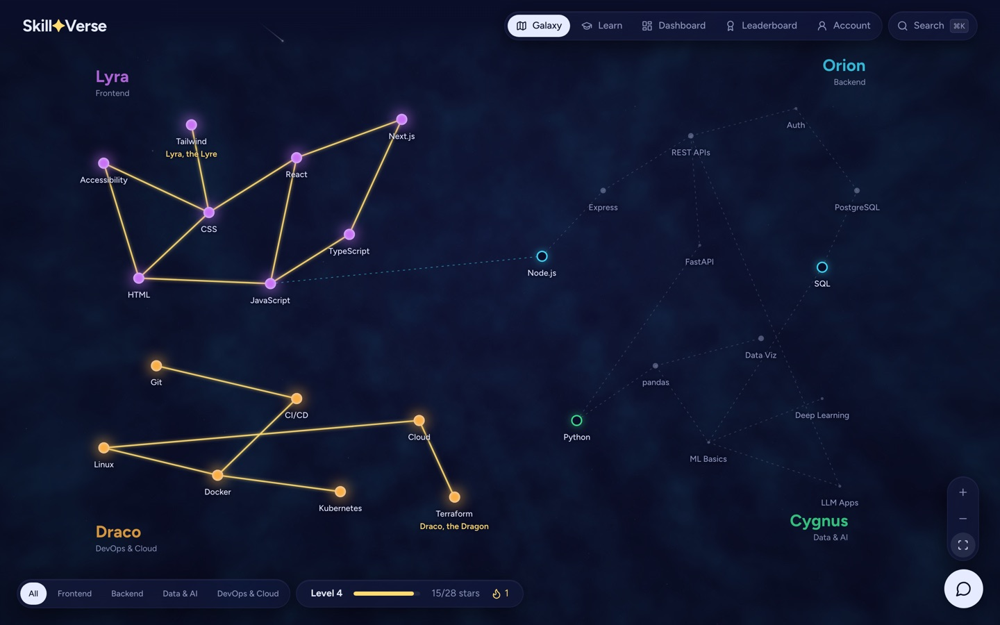
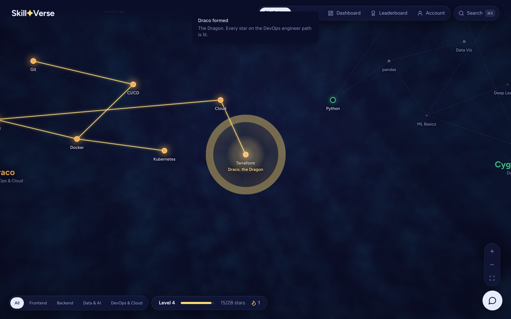
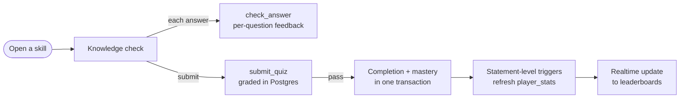

<div align="center">

# SkillVerse

Personalised learning paths on an interactive skill graph, with server-graded knowledge checks.

[Live demo](https://skillverse-sable.vercel.app) · [Architecture walkthrough](https://skillverse-sable.vercel.app/about) · [Security model](SECURITY.md)

[](https://github.com/aryansajiv19/SkillVerse/actions/workflows/ci.yml)


</div>

https://github.com/user-attachments/assets/14bd5aa6-041c-4cea-8e70-698c8ebd8937

## Overview

SkillVerse models a software engineering curriculum as a directed graph of skills and renders it as a navigable galaxy. Selecting any skill produces a personalised learning path: the unmastered prerequisites in dependency order, each with a lesson, curated free resources, practice exercises and a knowledge check. Completing every skill on a career path forms that path's constellation on the learner's map.

The backend is Supabase with no custom application server. PostgreSQL is the single authority for progress: quizzes are graded in the database, row-level security and least-privilege grants govern every table, and derived statistics are maintained by triggers. The project started as a hackathon prototype that stored all state in the browser, and was rebuilt as a full-stack application with authentication, server-side grading, a live leaderboard and a three-layer test suite.

## Contents

- [Features](#features)
- [Architecture](#architecture)
- [Engineering highlights](#engineering-highlights)
- [Performance](#performance)
- [Security](#security)
- [Testing](#testing)
- [Getting started](#getting-started)
- [Project structure](#project-structure)
- [Known limitations](#known-limitations)
- [Acknowledgements](#acknowledgements)

## Features

- **Learning paths.** A topological ordering of unmastered prerequisites for any target skill, including prerequisites that cross tracks.
- **Lessons.** Each skill has learning objectives, curated free resources (MDN, official documentation, web.dev and similar), a cheat sheet and practice.
- **Knowledge checks.** Multiple-choice and fill-in questions graded by PostgreSQL, with per-question feedback. Passing masters the skill and unlocks its dependents.
- **Code challenges.** JavaScript runs against test cases in a sandboxed Web Worker; HTML and CSS are validated with the browser's own parsers.
- **Constellations.** Career paths (full-stack, frontend, backend, AI, data, DevOps) defined as goal skills plus their prerequisite closure. Completion is derived from mastery and visualised on the map.
- **Progression.** XP, levels, current and best streaks, achievements, an activity heatmap and public profiles.
- **Live leaderboard.** Rankings update through Supabase Realtime.
- **Guest-first accounts.** Every visitor receives an anonymous account on first load, which can be upgraded in place by linking GitHub.
- **AI tutor.** A streaming Gemini assistant behind a per-user quota enforced in the database.
- **Accessibility.** Full keyboard navigation of the map, reduced-motion support and automated WCAG 2.1 AA checks.

<table>
  <tr>
    <td></td>
    <td></td>
  </tr>
  <tr>
    <td align="center">Learning path to a selected skill</td>
    <td align="center">Lesson with objectives and resources</td>
  </tr>
  <tr>
    <td></td>
    <td></td>
  </tr>
  <tr>
    <td align="center">Completed paths rendered as constellations</td>
    <td align="center">Constellation completion</td>
  </tr>
  <tr>
    <td></td>
    <td></td>
  </tr>
  <tr>
    <td align="center">Server-graded knowledge check</td>
    <td align="center">Sandboxed code challenge</td>
  </tr>
  <tr>
    <td></td>
    <td></td>
  </tr>
  <tr>
    <td align="center">Dashboard</td>
    <td align="center">Live leaderboard</td>
  </tr>
</table>

## Architecture


| Layer | Technology |
|---|---|
| Client | React 18, TypeScript (strict), Vite, TanStack Query, React Router, Tailwind CSS, Radix UI, Three.js via React Three Fiber |
| API | PostgREST over RLS-protected tables and four player-callable RPCs |
| Database | PostgreSQL 17: `public` schema for application data, `private` schema (not exposed through the API) for the answer key and rate limits |
| Auth | Supabase Auth: anonymous sessions, GitHub OAuth with PKCE, identity linking |
| Realtime | Supabase Realtime on `player_stats` |
| Serverless | Supabase Edge Function (Deno) for the AI tutor |
| Scheduled jobs | `pg_cron`: nightly purge of inactive guest accounts and expired rate-limit windows |
| Delivery | GitHub Actions (three jobs), Vercel, hosted Supabase |

### Quiz submission flow



## Engineering highlights

**The answer key never reaches the client.** Questions and answers are authored in [`content/challenges.ts`](content/challenges.ts), which no application module imports. A build step ([`scripts/catalog.ts`](scripts/catalog.ts)) emits a public catalog with deterministically shuffled options (FNV-1a seed, mulberry32) and a SQL file that loads the answer key into the unexposed `private` schema. CI fails if the catalog SQL is stale or if any answer explanation appears in the production bundle ([`scripts/check-bundle.ts`](scripts/check-bundle.ts)).

**Grading and mastery are atomic.** `submit_quiz` is a `SECURITY DEFINER` function with a pinned `search_path`. It verifies the caller and the skill's prerequisites, applies a rate limit, grades against the private key, and records the completion and mastery in the same transaction. Composite primary keys with `ON CONFLICT DO NOTHING` make awards idempotent, so a retake or duplicate submission awards no additional XP.

**Clients cannot forge progress.** Default privileges on the `public` schema are revoked and each role is granted only what it uses. For code challenges, clients hold an `INSERT` grant on a single column (`challenge_id`); `user_id` defaults to `auth.uid()` and `completed_at` to `now()`, so activity cannot be attributed to another user or backdated to inflate a streak.

**Statistics are maintained incrementally.** `player_stats` is refreshed by statement-level triggers using transition tables, so a bulk operation refreshes each affected player once rather than once per row. Streaks are computed with a gaps-and-islands query over UTC days. A database test asserts that trigger-maintained values always equal a full recomputation.

**The leaderboard scales linearly.** Rank is computed with a single `rank()` window pass over an index on `(xp DESC, user_id)`. An earlier design computed rank per row by counting players with more XP; because the public view accepts arbitrary filters such as `?rank=eq.1000`, that design allowed one request to trigger quadratic work. See [Performance](#performance).

**Derived state instead of stored state.** Learning paths and constellations are pure functions of the skill graph and the learner's mastered set. They cannot drift out of sync, need no additional tables or policies, and resetting a skill (a recursive CTE that also resets its dependents) updates them automatically.

**Untrusted code is isolated.** Learner JavaScript runs in a disposable Web Worker with no DOM or storage access and is terminated after 2 seconds. Output formatting is hardened against circular structures and throwing getters.

## Performance

Benchmarks run against local Supabase (PostgreSQL 17) with synthetic players, inside transactions that roll back. Scripts and methodology are in [`scripts/bench/`](scripts/bench).

| Measurement | Before | After |
|---|---:|---:|
| Leaderboard filtered by rank, 10,000 players | 5,398 ms (per-row count) | **3.4 ms** (window function) |
| Leaderboard filtered by rank, 50,000 players | > 120 s (statement timeout) | **17.6 ms** |
| Top-50 leaderboard read, 10,000 players | | 1.8 to 2.6 ms |
| Stats refreshes when a fully completed account resets | 50 (row-level trigger) | **1** (statement-level trigger) |

Route-level code splitting keeps the Three.js renderer (234 kB gzipped) out of every route except the map; the shared entry bundle is 160 kB gzipped.

## Security

The client is treated as fully untrusted, since every visitor holds a valid session. Controls enforced by the database and edge function include:

- Row-level security on every table, least-privilege grants, and no RPC callable without a session.
- `SECURITY DEFINER` functions limited to three player-callable entry points, each with a pinned `search_path` and an explicit caller check.
- Per-account rate limits returning HTTP 429: 600 answer checks, 120 quiz submissions and 40 tutor messages per hour.
- Input bounds on RPCs and a streamed 1 MB body cap on the edge function.
- PKCE for OAuth, and email confirmation retained to prevent pre-account takeover through identity linking.

Schema-wide invariants (RLS enabled everywhere, exact grants, pinned search paths, no anonymous RPC access) are asserted in [`supabase/tests/05_security.test.sql`](supabase/tests/05_security.test.sql), so an unprotected table or function fails CI. The full threat model and accepted trade-offs are documented in [SECURITY.md](SECURITY.md).

## Testing

| Suite | Scope | Command |
|---|---|---|
| Database (pgTAP) | 63 tests: write rules and authorization, grading, stats consistency, streaks, rate limits, scheduled jobs, schema-wide security invariants | `npx supabase test db` |
| Unit (Vitest) | 220 tests: learning-path ordering, constellation completion, catalog integrity (a reference solution for every code challenge), sandbox runner, colour contrast | `npm test` |
| End-to-end (Playwright) | 19 tests: learner flows against a local Supabase stack, plus axe WCAG 2.1 AA scans of 10 pages with no rules disabled | `npm run test:e2e` |
| Benchmarks | Leaderboard and stats-trigger cost at 10,000 and 50,000 players | [`scripts/bench/`](scripts/bench) |

CI runs type checking, linting, unit tests, a catalog freshness check, the production build, the answer-leak check, the database tests and the end-to-end suite on every push.

## Getting started

### Prerequisites

- Node.js 22 or later
- Docker (for the local Supabase stack)

### Installation

```bash
npm ci
npx supabase start            # local Postgres, Auth, Realtime and edge runtime
cp .env.example .env.local    # set API_URL and PUBLISHABLE_KEY from `npx supabase status`
npm run dev                   # http://localhost:8080
```

`npx supabase db reset` rebuilds the database from the migrations and the generated catalog. [`scripts/seed-demo.sql`](scripts/seed-demo.sql) loads demo learners for the leaderboard. After editing content, regenerate the catalog with `npm run db:catalog`.

### Verification

```bash
npm run typecheck && npm run lint && npm test
npm run build && npm run check:bundle
npx supabase test db
npm run test:e2e
```

## Project structure

| Path | Contents |
|---|---|
| [`src/pages/`](src/pages) | Galaxy, lessons, dashboard, leaderboard, profiles, architecture page, account |
| [`src/components/map/`](src/components/map) | Pan and zoom, framing and map geometry |
| [`src/hooks/useProgress.ts`](src/hooks/useProgress.ts) | All data access: queries, RPCs and Realtime subscriptions |
| [`src/lib/`](src/lib) | Auth, progress rules (learning paths, constellations), code runner and worker |
| [`src/content/`](src/content) | Skill graph, constellations, lessons and resources |
| [`content/`](content) | Authored challenges including answers (never imported by the client) |
| [`supabase/`](supabase) | Migrations, generated catalog, pgTAP tests and the tutor edge function |
| [`scripts/`](scripts) | Catalog generator, bundle check, benchmarks and media capture |
| [`e2e/`](e2e) | Playwright tests and shared selectors |

## Known limitations

- **Quiz feedback is stateless.** Per-question feedback reveals the correct answer, so a failed attempt informs the next one. Grading still enforces prerequisites and the XP ceiling. Question pools with randomised draws and attempt cooldowns are the documented mitigation if results ever carry weight.
- **Single-player rank reads scan `player_stats`.** Acceptable at current scale (about 10 ms at 45,000 players); an index range-count RPC is the upgrade path.

## Acknowledgements

Built by [Aryan Sajiv](https://github.com/aryansajiv19). The original hackathon prototype was created with Divyansh Jhajhria.
