<div align="center">

# SkillVerse

**A star map of what to learn next.** Every skill is a star. Pass its skill check to light it up and unlock the stars it connects to.

<!-- DEMO_LINK -->

[](https://github.com/aryansajiv19/SkillVerse/actions/workflows/ci.yml)


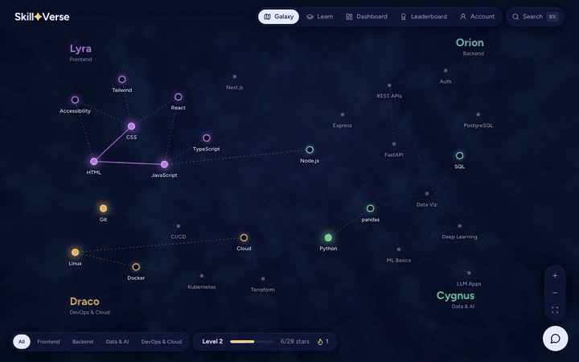

</div>

## Why I revived it

SkillVerse started as a hackathon MVP: a galaxy-themed skill tracker built by my teammate Divyansh Jhajhria with a lot of charm and no backend. Progress lived in `localStorage`, the leaderboard was hardcoded, the AI chat pointed at a service we no longer had, and completing a skill crashed on a stray `require()`.

I wanted to keep what made it fun, learning as a map you light up, and make it a real app: real accounts, real grading, a real leaderboard, and a codebase I'd be happy for someone to read.

## How it works

1. **Pick a star.** 28 skills across four constellations: Frontend, Backend, Data & AI, and DevOps & Cloud. Prerequisites cross tracks, so LLM Apps needs both ML Basics and REST APIs.
2. **Take the skill check.** A short quiz graded by the database. Miss one question and you still pass.
3. **Watch it light up.** The map flies to the star, it ignites, and lines draw out to the stars it just unlocked.
4. **Practise for bonus XP.** 21 code challenges run real tests in your browser, plus a debugging game. Every skill has a short reading list of free guides.
5. **Keep going.** XP, levels, streaks, achievements, a public profile with an activity heatmap, and a leaderboard that updates live.

No sign-up wall: every visitor gets a guest account on first load, and can connect GitHub to keep it.

<table>
  <tr>
    <td>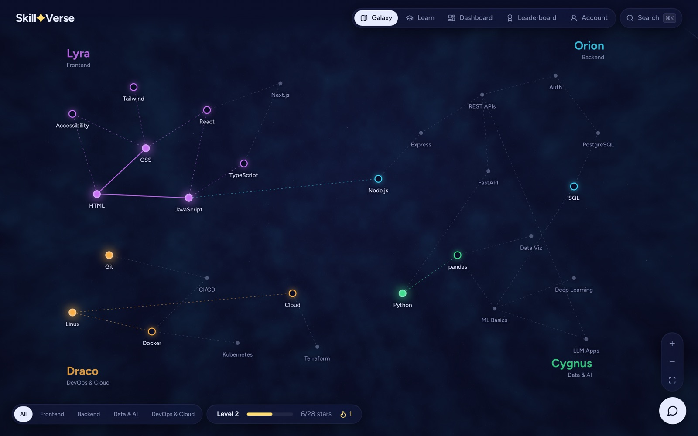</td>
    <td>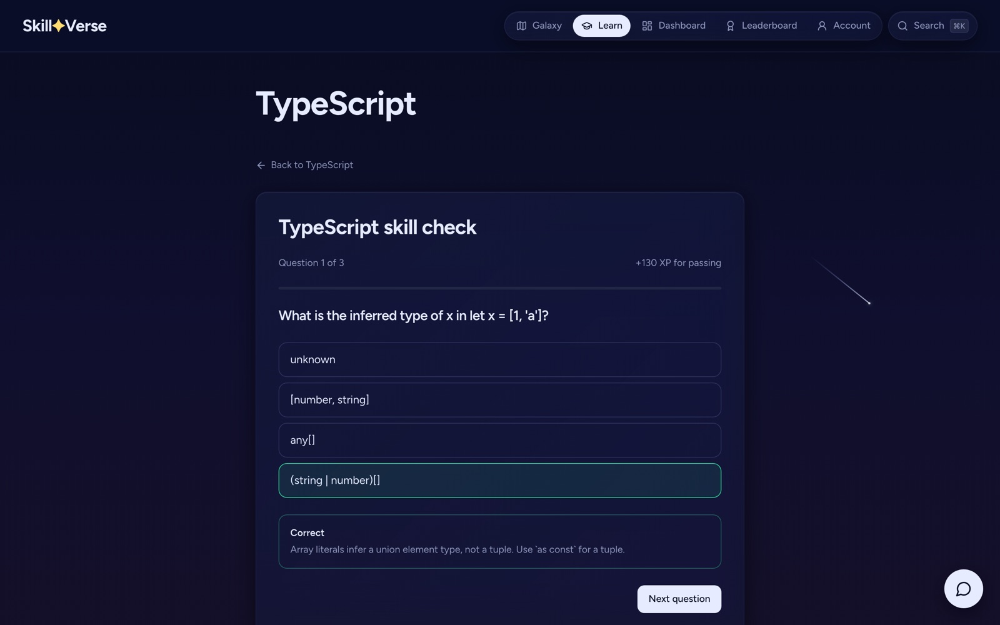</td>
  </tr>
  <tr>
    <td align="center">The galaxy: hollow rings are open, filled stars are mastered</td>
    <td align="center">Skill checks, graded on the server</td>
  </tr>
  <tr>
    <td>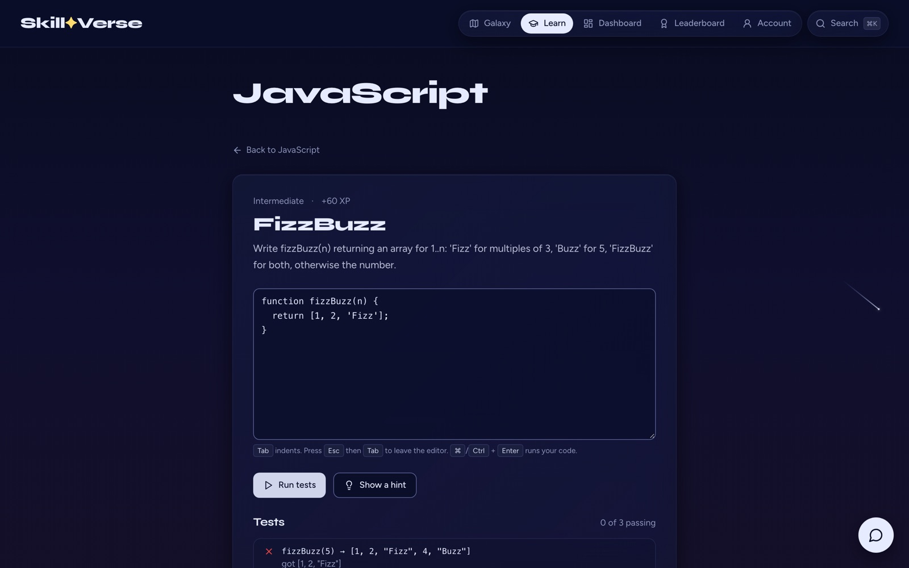</td>
    <td>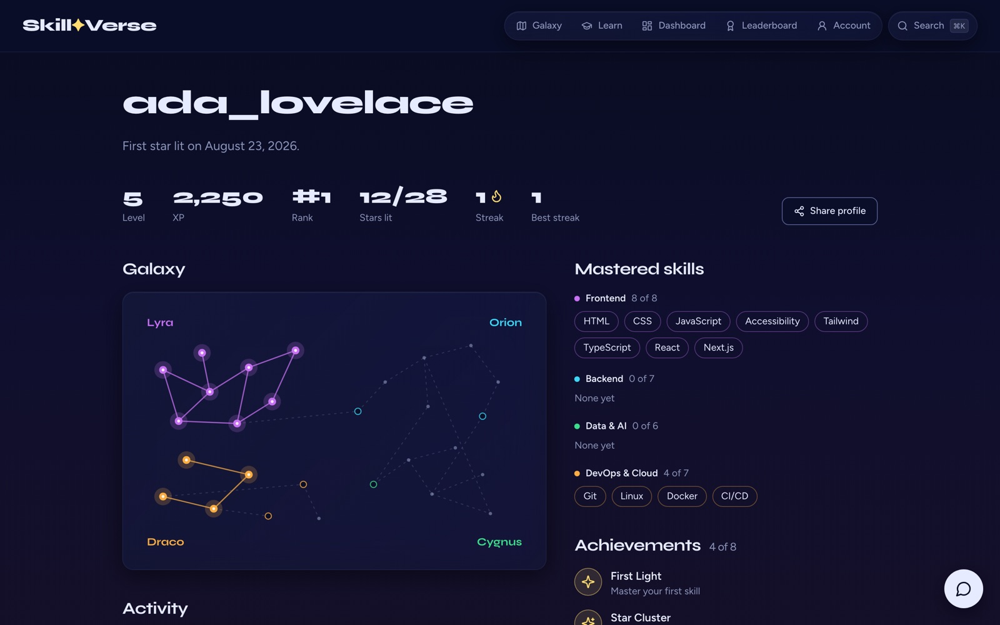</td>
  </tr>
  <tr>
    <td align="center">Code challenges run in a sandboxed Web Worker</td>
    <td align="center">Public profiles</td>
  </tr>
  <tr>
    <td>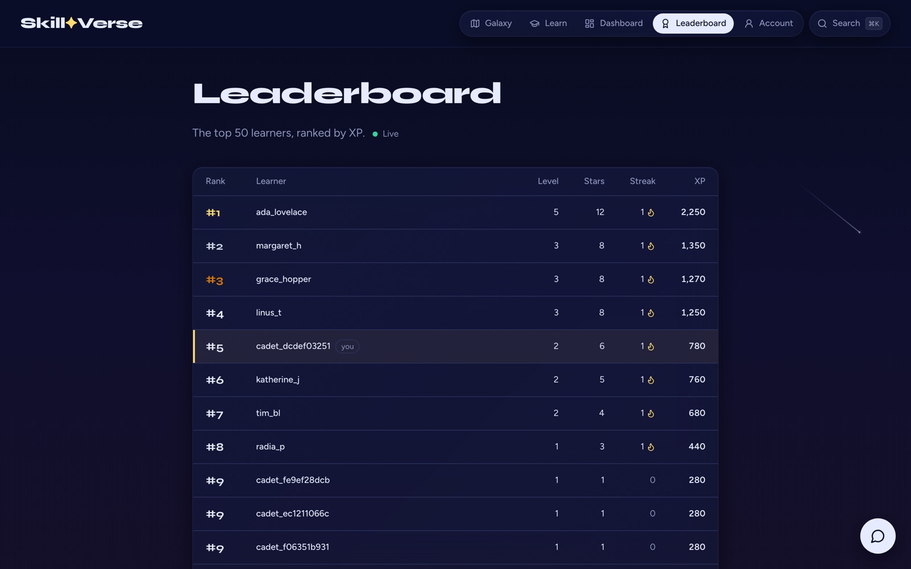</td>
    <td>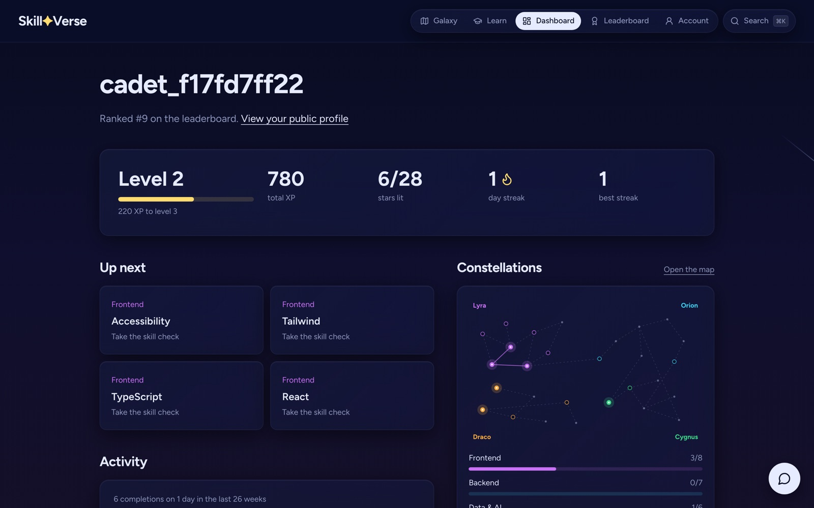</td>
  </tr>
  <tr>
    <td align="center">Live leaderboard</td>
    <td align="center">Dashboard and activity heatmap</td>
  </tr>
</table>

<p align="center">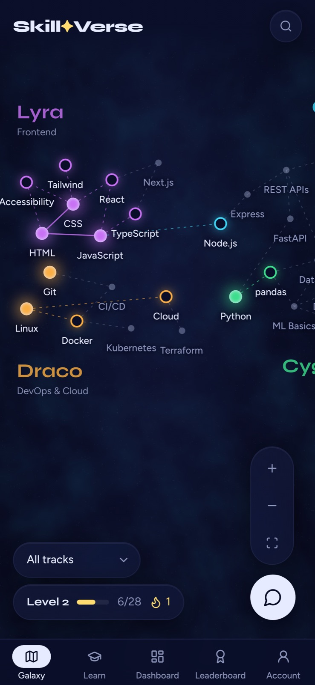</p>

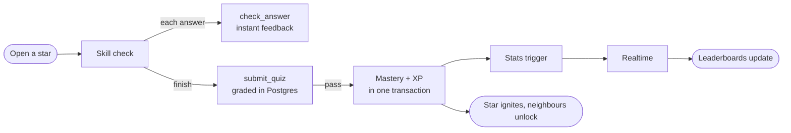

## Under the hood

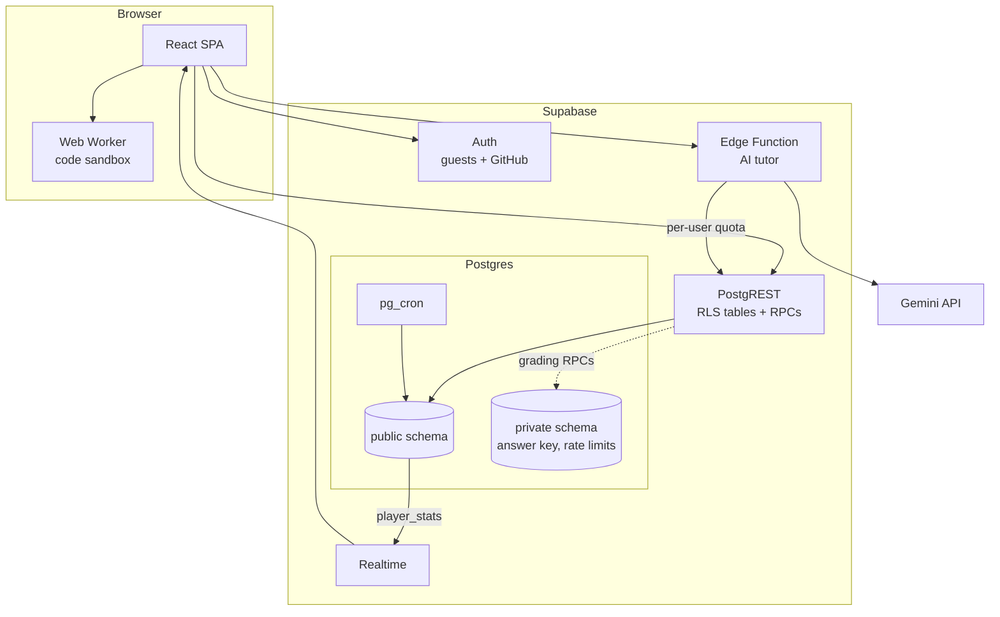

The app has no custom server. Postgres enforces every rule through row-level security and a handful of functions, and one edge function relays the AI tutor. There's a deeper walkthrough in the app's **How it's built** page.

<p align="center">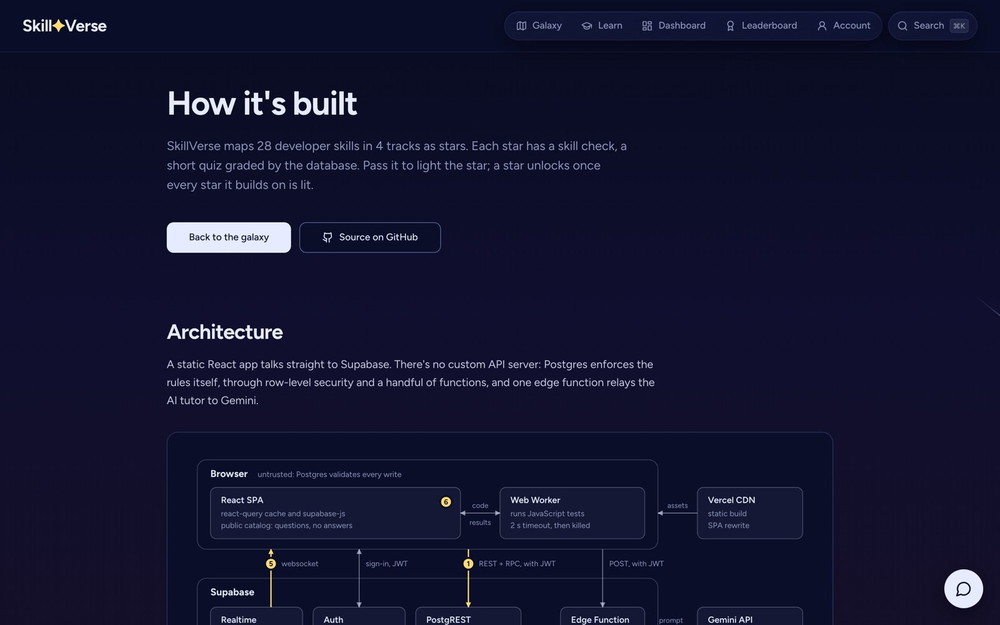</p>

A few decisions I'm proud of:

* **The answers never reach the browser.** Quiz answers are written in [`content/challenges.ts`](content/challenges.ts), which nothing in the app imports. A build step splits them into a public catalog (questions, deterministically shuffled options) and a private answer key in Postgres that the API can't read. CI builds the app and fails if any explanation text appears in the shipped JavaScript.
* **The database is the only authority.** Clients can't write masteries or stats at all, and for code challenges they can insert one column: the user id and timestamp come from the server, so activity can't be forged or backdated to fake a streak. A pgTAP suite asserts these as schema-wide invariants, so a new table or function that skips them fails CI.
* **A leaderboard query that doesn't fall over.** The first version ranked each player by counting everyone with more XP. That's fine for a top-50 read, but the view is public, and filtering on rank ran that count for every player. [Measured](scripts/bench/README.md) at 10,000 players: **5,398 ms → 3.4 ms** with a single `rank()` window pass. At 50,000 players the old query hit a 120 s timeout; the new one takes 17.6 ms.
* **Stats are maintained, not recomputed.** Statement-level triggers with transition tables refresh a player's stats once per write, however many rows it touched. Resetting a fully completed account takes 0.57 ms, versus 4.4 ms refreshing once per row. A test proves the incremental numbers always match a full recompute.
* **Learner code runs in a disposable worker.** JavaScript challenges run in a Web Worker with no DOM or storage access, killed after 2 seconds. HTML and CSS are checked with the browser's own parsers, honouring the real cascade and selector lists.
* **Three.js stays off the pages that don't need it.** Routes are code-split, so the 227 kB (gzipped) galaxy renderer only loads on the map. A shared profile link loads a 156 kB entry bundle.

## Things I learned the hard way

* **Put the right answer first and people will notice.** I wrote every multiple-choice question with the correct option first. A 164-agent review caught that "always pick A" passed four of the Backend checks. Options are now shuffled deterministically at build time, and a test fails if any position holds more than 40% of the answers.
* **Waiting for everything is a bug.** Under load, a finished quiz could sit on "Grading…" because the submit waited for every query in the app to refetch, including the leaderboard. It now waits only for the learner's own data, which also made the parallel e2e suite stable.
* **A free model tier can disappear under you.** The tutor's model was retired for new keys partway through. It's now one setting (`GEMINI_MODEL`), and the tutor degrades to a clear "not configured" state instead of breaking the page.

## Tests

| What | How | Run it |
|---|---|---|
| Database | 63 pgTAP tests: RLS, grading, stats vs full recompute, streaks, rate limits, guest cleanup, privilege invariants | `npx supabase test db` |
| Logic and content | 210 Vitest tests: catalog integrity, a reference solution proving every code challenge is solvable, the runner, theme contrast | `npm test` |
| The whole app | 18 Playwright tests, including axe WCAG 2.1 AA scans of 10 pages with no rules disabled | `npm run test:e2e` |
| Performance | Leaderboard and stats-trigger benchmarks at 10k and 50k players | [`scripts/bench/`](scripts/bench) |

Every push runs typecheck, lint, unit tests, a catalog freshness check, the build, the answer-leak check, the database tests and the e2e suite in [CI](.github/workflows/ci.yml).

## Run it yourself

Needs Node 22+ and Docker.

```bash
npm ci
npx supabase start          # local Postgres, Auth, Realtime and the edge runtime
cp .env.example .env.local  # paste API_URL and PUBLISHABLE_KEY from `npx supabase status`
npm run dev                 # http://localhost:8080
```

`npx supabase db reset` rebuilds the database from the migrations and the catalog. To fill the leaderboard with demo learners, load [`scripts/seed-demo.sql`](scripts/seed-demo.sql). After editing content, run `npm run db:catalog`.

## Where things live

| Folder | What's in it |
|---|---|
| [`src/pages/`](src/pages) | Galaxy, learn, dashboard, leaderboard, profiles, how it's built, account |
| [`src/components/map/`](src/components/map) | Pan and zoom, framing, the map's geometry |
| [`src/hooks/useProgress.ts`](src/hooks/useProgress.ts) | All data access: queries, RPCs, Realtime |
| [`src/lib/`](src/lib) | Auth, progress rules, the code runner and its worker |
| [`content/`](content) | Challenges as written, with answers (never imported by the app) |
| [`supabase/`](supabase) | Migrations, the generated catalog, pgTAP tests, the tutor function |
| [`e2e/`](e2e), [`scripts/`](scripts) | Browser tests, the catalog generator, benchmarks, media capture |

Security model and trade-offs: [`SECURITY.md`](SECURITY.md).

**Built with** React 18, TypeScript, Vite, Tailwind CSS, Radix, TanStack Query, Three.js, Supabase (Postgres, Auth, Realtime, Edge Functions, pg_cron), Gemini, Playwright and Vercel.

<div align="center">

Started as a hackathon MVP by **Divyansh Jhajhria** · Rebuilt by **Aryan Sajiv** · [GitHub](https://github.com/aryansajiv19)

</div>
