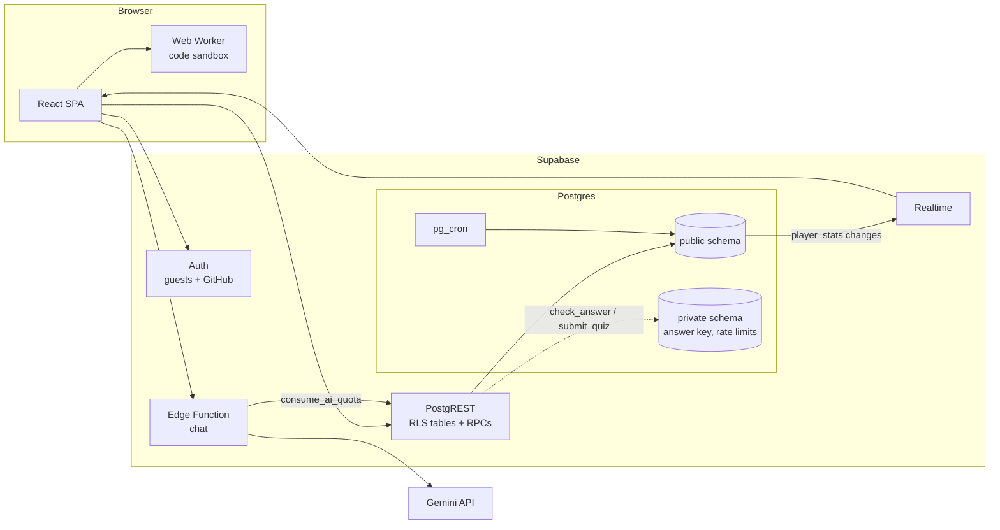

# SkillVerse

**A star map of what to learn next.** Every skill is a star. Pass its skill check to light it up and unlock the stars it connects to, across four constellations: Frontend, Backend, Data & AI, and DevOps & Cloud.

<!-- DEMO_LINK -->


SkillVerse started as a hackathon MVP. This repository is its rebuild into a full-stack application: a real database with row-level security, server-side grading, live leaderboards, public profiles, and a test suite that covers the database, the app and the browser.

## What you can do

- **Explore the galaxy.** 28 skills across four tracks, with prerequisites that cross tracks (LLM apps need both ML basics and REST APIs). Pan, zoom, and focus a track.
- **Pass skill checks.** Short quizzes graded on the server. You can miss one question and still pass. Passing lights the star.
- **Write code that actually runs.** JavaScript challenges run against real tests in a sandboxed Web Worker; HTML and CSS challenges are checked with the browser's own parsers.
- **Track progress.** XP, levels, streaks, achievements and an activity heatmap, all computed in Postgres.
- **Compete and share.** A live leaderboard and a public profile page for every learner.
- **Ask the tutor.** An AI tutor that knows what you're studying and gives hints rather than answers (optional, free tier).
- **No sign-up wall.** Every visitor gets a guest account instantly; link GitHub to keep it.

## How it's built



| Layer | Choices |
|---|---|
| Frontend | React 18, TypeScript (strict), Vite, Tailwind, Radix/shadcn primitives, TanStack Query, React Router, Three.js background |
| Backend | Supabase: Postgres 17 with RLS, PostgREST RPCs, Realtime, Auth (anonymous + GitHub identity linking), Edge Functions (Deno), pg_cron |
| Testing | pgTAP (database security and logic), Vitest (content integrity, runner, rules), Playwright + axe (end-to-end and accessibility) |
| Delivery | GitHub Actions CI, Vercel (static SPA on the CDN) |

The in-app [How it's built](/about) page walks through it in more depth.

### Security model

- **Answers never reach the browser.** Quiz answers and explanations live in a `private` schema the API can't read. `check_answer` and `submit_quiz` grade in Postgres. A build step (`npm run check:bundle`) fails if any explanation text appears in the shipped JavaScript.
- **The database is the authority.** Row-level security plus least-privilege grants: clients can only insert a challenge id (the user id and timestamp come from the server, so activity can't be backdated), can't write masteries or stats at all, and can't touch another player's rows.
- **Server functions are narrow.** `SECURITY DEFINER` functions pin `search_path`, check the caller, check that the skill is unlocked, bound their inputs, and spend a per-user rate limit that surfaces as HTTP 429.
- **The AI tutor is metered.** The edge function requires a valid session JWT and spends a database-enforced hourly quota before calling the model.

See [SECURITY.md](SECURITY.md) for the threat model and known trade-offs.

### Built to scale

- **Stats are maintained, not recomputed.** Statement-level triggers refresh one player's `player_stats` row when their completions change (bounded by the catalog size), so a bulk reset costs one refresh.
- **Ranking is one pass.** Rank is a single `rank()` window over `player_stats`, and reading the top of the leaderboard stops after N rows of the XP index. (An earlier per-row count let one request that filters on rank do quadratic work; the security review replaced it.)
- **Live without stampedes.** Leaderboards subscribe to `player_stats` over Realtime and debounce refetches.
- **Small first load.** Routes are code-split; Three.js only loads with the galaxy.
- **Housekeeping.** pg_cron purges idle guest accounts nightly.

### Content pipeline

Challenges are authored in [`content/challenges.ts`](content/challenges.ts) with their answers. `npm run db:catalog` splits them into a public catalog for the app (questions and deterministically shuffled options, no answers) and [`supabase/catalog.sql`](supabase/catalog.sql) for the database (skill graph, XP, private answer key). CI fails if either generated file is stale.

## Running it locally

Requires Node 22+ and Docker.

```bash
npm install
npx supabase start          # local Postgres, Auth, Realtime, Edge runtime
cp .env.example .env.local  # then paste API_URL and PUBLISHABLE_KEY from `npx supabase status`
npm run dev                 # http://localhost:8080
```

`npx supabase db reset` rebuilds the database from the migrations and the catalog.

| Command | What it does |
|---|---|
| `npm test` | Vitest: content integrity, reference solutions for every JS challenge, runner and progress rules |
| `npx supabase test db` | pgTAP: RLS, grading, stats, rate limits, cleanup |
| `npm run test:e2e` | Playwright end-to-end and axe accessibility scans |
| `npm run typecheck` / `npm run lint` | Strict TypeScript and ESLint |
| `npm run db:catalog` | Regenerate the public catalog and `supabase/catalog.sql` after editing content |
| `npm run check:bundle` | After `npm run build`: prove no quiz answers shipped |

## Project layout

```
content/                 authoring source for challenges (with answers; never imported by the app)
scripts/                 catalog generator, bundle check, OG image renderer
src/content/             public catalog, skills and tracks, curated resources
src/hooks/useProgress.ts all data access (queries, RPCs, Realtime)
src/lib/                 auth, progress rules, code runner + worker
src/pages/               galaxy, learn, dashboard, leaderboard, profiles, about, account
supabase/migrations/     schema, grading, stats, operations
supabase/tests/          pgTAP suites
supabase/functions/chat/ AI tutor edge function
e2e/                     Playwright specs
```

## Credits

SkillVerse began as a hackathon MVP built by **Divyansh Jhajhria** for our team. It was rebuilt into a full-stack application by **Aryan Sajiv**: the database, security model, grading, content, design and tests in this repository.
